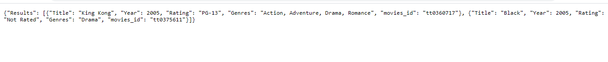

# API_TASK
User search for movie which does not exist in local database, than get movies data from IMDB API and store in local database, Also search data by id, movie release year, rating etc from local database.

## SEARCH by title if search data does not exist in your local database then it will fetch from IMBD API.

## results API Data

  
## search movie from local database by id, movie release year, rating etc.

 
## results API Data

