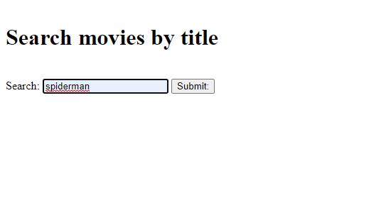
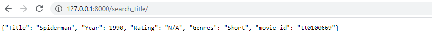
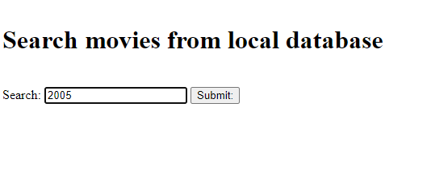

# API_TASK
Created API for fetch data from IMDB API if user search does not exist in local database, get data from IMDB API and store in local database, Also search data by id, movie release year, rating etc from local database.

# SEARCH by title if search data does not exist in your local database then it will fetch from IMBD API.

 
# results API Data

  
# search data from local database by data by id, movie release year, rating etc.

 
# results API Data

